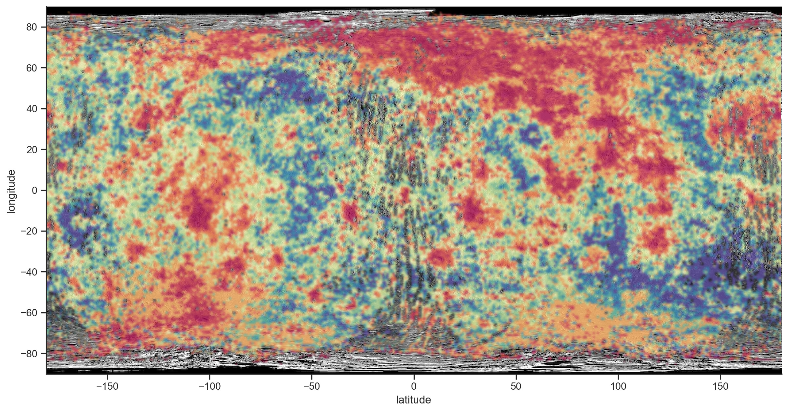

# Introduction {#sec:4b.intro}

The sheer amount of data returned by scientific missions aimed at
exploring the solar system and observing exoplanets in recent decades
overwhelms classical methods to explore and discover important
scientific aspects of the target body. As an example, the Mercury data
return for Mariner 10 was less than 100 MB, while MESSENGER delivered
about 23 TB. Future missions are expected to exceed this limit. In
addition, there is a trend of increasing complexity in the data itself,
e.g., going from the of Mariner-10 to the hyperspectral datasets
expected from BepiColombo. This situation clearly indicates that some
form of automated analysis would be beneficial, provided it is able to
save time without a loss of the information content of the data.

Keeping the focus on hyperspectral remote sensing data, the typical
approach for analysing this kind of data is to model the observed
radiation with a forward radiative model[like Hapke, as in
@Hamilton2005] or attempt to reproduce the observed radiation by setting
up relevant samples in a laboratory setting using chemical and/or
geomorphological context information.[e.g., @Helbert2013] Complex
forward models that are able to take into account the relevant physics
are typically computationally intensive and difficult to use to
investigate the very large parameter space covered by hyperspectral
data. This consideration is even more relevant for laboratory
investigations : physical simulation needs the target to be physically
fabricated, hence more and and more parameters means more experiments
and more time. Models need computational power to be calculated in a
reasonable amount of time, but could be distributed on several machines
to overcome this limitation. This workaround is not effective for
laboratory experiment, because most only few places meets of the
environment needed for space sample simulation, like high-vacuum,
-temperature, -radiation and so on.

Without a way to efficiently and rapidly explore large amounts of
complex data, it is likely that valuable information will be missed in
large hyperspectral data sets.

Geological maps are the gold standard for remote planetary surface
studies, but producing them is an extremely time-consuming task. This
process can suffer from user bias and typically only uses a few data
points (e.g., 3-channel images) to describe different units. For
example,[@Denevi2009] mapped the distribution and extent of major
terrain types of Mercury using MESSENGER Mercury Dual Imaging System
(MDIS) camera observations of Mercury. While the camera has 11 spectral
bands, the maps typically used for the terrain differentiation are RGB,
where 3 representative spectral bands are mapped onto the three image
color channels.

Geomorphological maps take in account additional features like surface
roughness and crater density as a proxy for the age, where the
correlation between age and crater density are derived from
models.[e.g., @blandCraterCounting2003; @kerrWhoCanRead2006] Automated
techniques are becoming more common in planetary science applications,
as this books testifies, and the aim of this chapter is to illustrate
how to apply unsupervised learning techniques to remote sensing data.
This approach requires minimal user interaction and yields
scientifically interesting products like classification maps that can be
directly compared with geomorphological maps and models. We present an
analysis of spectral reflectance data of Mercury's surface collected by
the Mercury Atmospheric and Surface Composition Spectrometer (MASCS)
instrument during orbital observations of the NASA MESSENGER mission
between 2011 and 2015.[@McClintock2007] MASCS is a three sensor point
spectrometer with a spectral coverage from 200 nm to 1450 nm. After a
brief overview of the instrument and its significance for the
investigation of Mercury (section
[2](#sec:4b.mercury_mascs){reference-type="ref"
reference="sec:4b.mercury_mascs"}), we will illustrate how we extract
and resample the data to a format useful for our ML application (section
[3](#sec:4b.dataprep){reference-type="ref"
reference="sec:4b.dataprep"}). Then we show how to compress the data
(section
[4.1](#sec:4b.dimensionality_reduction_ica){reference-type="ref"
reference="sec:4b.dimensionality_reduction_ica"}), how to project them
to a lower number of dimensions (section
[4.2](#sec:4b.manifold_learning){reference-type="ref"
reference="sec:4b.manifold_learning"}), and finally, how to group
"similar" data points together to discover salient spectral classes and
their distribution on the surface. We conclude in section
[4.4](#sec:4b.conclusion){reference-type="ref"
reference="sec:4b.conclusion"} by providing a basic comparison of the
result of the discovered spectral class distribution with maps of the
surface of Mercury obtained using classical methods, in order to provide
a first assessment of the machine learning techniques presented here.

# Mercury and the MASCS instrument {#sec:4b.mercury_mascs}

Surface mineralogy and composition are important indicators of the past
of a planetary body, since they provide hints about the processes that
formed and altered the crust, which is largely the result of the
interior evolution. For example, the possibility of identifying specific
mineral assemblage like metamorphic rocks, which are known to form in
specific pressure and temperature conditions, would provide indications
on the physical processes occurring in the subsurface that produced
those rocks and later transported the rocks to the surface.[e.g.,
@namurSilicateMineralogySurface2017] Similarly, observations of hydrated
minerals can be interpreted as indicating the possible past presence of
water, as in the case of Mars.[@meslinSoilDiversityHydration2013]

While some investigations have been published on Mercury's surface
mineralogy,[e.g.,
@e.vanderkaadenGeochemistryMineralogyPetrology2017; @namurSilicateMineralogySurface2017; @Vilas2016a; @Sprague2009]
its link to the endogenous (e.g., mantle convection) and exogenous
(e.g., impacts) processes that operated during the history of the planet
is still difficult to elucidate.[e.g.,
@padovanImpactinducedChangesSource2017] A relevant example is the
geological features known as hollows, discovered on the surface of
Mercury in MESSENGER data. Hollows are rimless depressions with flat
floors, surrounded by halos of high-albedo material, and typically found
in clusters.[@blewett2011hollows] Given this evidence, their formation
mechanism likely includes the loss of volatile material through one or
more processes such as sublimation, space weathering, outgassing, or
pyroclastic flow. Hollows are associated with a particular spectral
signature in MESSENGER's MDIS camera,[@Vilas2016a] but a specific
spectral signature in spectrometer data could not be identified due to
the coarse spatial resolution of the spectrometer. Overall, the only
clear inference based on VNIR spectra obtained by the MASCS instrument
is that Mercury's surface shows little variation, displaying no distinct
spectral features except for the possible indication of sulfide
mineralogy within the hollows.[@Vilas2016a]

MASCS consists of a small Cassegrain telescope with an effective focal
length of 257 mm and a 50-mm aperture that simultaneously feeds an
UltraViolet and Visible Spectrometer (UVVS) and a Visible and InfraRed
Spectrograph (VIRS) channel. VIRS is a fixed concave grating
spectrograph with a focal length of 210 mm, equipped with a beam
splitter that simultaneously disperses the light onto a 512-element
sensor (VIS, 300--1050 nm) and a 256-element infrared sensor array (NIR,
850--1450 nm). Data obtained by MASCS covers almost the entire surface
of Mercury. The spatial resolution is highly latitude dependent due to
the very elliptical orbit of the spacecraft, but a reference value
$\sim5$ km. This low spatial resolution is a trade-off for higher
spectral resolution and more spectral channels compared to the imaging
instruments (i.e., the MDIS).

The NIR sensor is characterized by 3 -- 5 times lower signal-to-noise
ratios (SNRs) than the VIS detector and does not add significant
information to the VIS sensor in our tests. NIR measurement cann be
linked and corrected to match corresponding VIS measurements
following.[However, see @Besse2015 for a successful VIS/NIR cross
correction.] The biggest obstacle is that the the most accurate
photometric corrections is only available for the VIS channel.[see.
@domingueAnalysisMESSENGERMASCS2019; @domingueAnalysisMESSENGERMASCS2019a]
We then analysed only data from VIS channel, that is enough for the sake
of illustrating unsupervised learning techniques.

# Data preparation {#sec:4b.dataprep}

In what follows, we use "feature" to refer to a single spectral
reflectance value in a given spectrum and refer to the spectrum as an
"observation". An observation is taken on a particular area of the
surface of Mercury at a given time and thus with a given illumination
condition. MASCS data are obtained as a collection of binary files
following the PDS3 standard.[@nasaPDSPDS3Standards2009] We need to
preprocess these to be represented as a matrix of shape $[N \times M]$
where $M$ is the number of features and $N$ is the number of
observations before they can be used as input to typical machine
learning algorithms. A spectrum can be represented as a vector, with the
single spectral channels being its components, i.e.,
$\hat{x} = (x_1 ,..., x_{512})$, for the case where the spectrum
$\hat{x}$ has 512 components. The entire MASCS dataset comprises about 5
million spectra, each with 512 channels. The coverage is not homogeneous
across Mercury's surface, as illustrated in Figure
[1](#fig:mascskuiper){reference-type="ref" reference="fig:mascskuiper"}.
In this section we describe how to create a homogeneous gridded
representation of the observations across the entire surface so that we
can apply our clustering algorithm to the entire surface, as shown in
Figure [2](#fig:mascsglobalgrid){reference-type="ref"
reference="fig:mascsglobalgrid"}.

{#fig:mascskuiper width="500px"}

{#fig:mascsglobalgrid width="500px"}

A typical workflow for doing a planetary science analysis starts with
the definition of a number of Regions Of Interests (ROIs), followed by a
search for all data points that fall within these ROIs. This approach
facilitates the extraction of spectral signatures that are specific to
user-defined geological units in order to explore their properties in
the context of different ROIs. For this chapter, we developed a workflow
that starts by extracting the data from the original files using the
GDAL[^2] python binding. We then organized them in a PostgreSQL
relational database [^3], with the PostGIS spatial extension[^4]. The
database is currently hosted at the DLR in Berlin.

First, the whole dataset of $\sim5$ million spectra is resampled to a
planet-wide rectangular grid of $1^\circ\times1^\circ$ in the
latitudinal band between $\pm80^\circ$. The cell longitudinal size
varies between $\sim40$ km at the equator to a minimum of $\sim10$ km at
$\pm 80^\circ$. Thus, the area spanned by each grid cell depends on the
latitude. However, the same is true for the acquisition process, where
higher spatial resolution is reached near the equator and lower
resolution at the poles. Next, we resampled the data in the spectral
dimension to a common wavelength range[^5] from 260 nm to 1052 nm with a
 4 nm resolution (2 nm spectral sampling), resulting in 396 spectral
channels. This approach slightly oversamples the original 4.77 nm
spectral resolution and removes some points from the original 200-1050
nm range. The resulting data matrix is expressed in tabular form, with
each row representing a single grid cell or pixel on the surface. The
elements of each row are the spectral reflectance values from the VIS
instrument at 396 (resampled) wavelengths. The dataset now has dimension
$[N \times M]$ where $N$ is the number of grid cells
($360 \times 180 = 64,800$) and $M$ is the number of spectral features
($396$). Due to the incomplete coverage and data filtering, some grid
cells are empty. After removing these empty cells, the size of the
dataset is \[$55399 \times 396$\]. As an example, Figure
[2](#fig:mascsglobalgrid){reference-type="ref"
reference="fig:mascsglobalgrid"} shows the distribution of the
normalized reflectance at a fixed wavelength (700 nm).

We used a recent dataset that had large-scale photometric
corrections[@domingueAnalysisMESSENGERMASCS2019; @domingueAnalysisMESSENGERMASCS2019a]
and thus was almost free from observation geometry effects. However,
extreme geometry are still present and are typically associated with
high noise and some residual instrumental effects. Based on our
empirical tests, we filtered out observations with an emission/incidence
angle $\ge$`<!-- -->`{=html}80$^\circ$. We also calculated the median
value per wavelength and per cell grid when constructing the global
hyperspectral data cube and filtered out observations falling under the
$2^{nd}$ percentile and above $99.9^{th}$ percentile to clean some
residual geometry effects. With this approach we create an effective
noise filter while retaining enough observations to be able to analyse
the entirety of the surface of the planet.

# Learning from multivariate data

## Dimensionality reduction: ICA {#sec:4b.dimensionality_reduction_ica}

{#fig:ICA_reconstruction_error_zoom_included width="500px"}

{#fig:ICA_components width="500px"}

{#fig:ICA_components_map width="500px"}

One way to discover salient patterns in a large set of multidimensional
data is to perform dimensionality reduction. Two popular techniques for
dimensionality reduction are Independent Component Analysis (ICA) and
Principal Component Analysis (PCA).

PCA try to find a reduced-rank representation of the data and seeks for
that best explains the variability of the data.

ICA is a case of blind source separation techniques and assumes that the
observations are non-Gaussian signals and statistically independent from
each
other.[@hastieElementsStatisticalLearning2009; @hyvarinenIndependentComponentAnalysis2000]
ICA aims to find a set of new basis vectors as Principal Component
Analysis, but with different assumptions and significance of the new
basis. ICA search a basis where each vector is an independent component:
if one think of a mix of superposed audio signals, the ICA basis will
return a vector for each independent signal, like in the Blind Signal
Separation techniques. ICA helps to find a representation of the data as
independent sub-elements.

In practical terms, PCA helps to compress data and ICA helps to separate
data.

The data cube obtained from previous section is then decomposed with
ICA, trying to separate multivariate signal into additive
sub-components.

We represent the input data as $\hat{x}=(\hat{x}_1, ...,\hat{x}_n)^T$,
where $\hat{x}_i$ is a vector of $396$ spectral reflectance values for a
given observation. ICA tries to find a linear transformation $W$ so that
$\hat{s}=W\hat{x}$, where $\hat{s}=(\hat{s}_1, ...,\hat{s}_k)^T$ is a
vector of maximally independent components and $k \leq n$. $W$ is also
called the mixing matrix and has dimension $[f \times k]$ = \[ (data
dimension)$\times$ (number of ICA independent sources)\]. The original
sources $\hat{s}$ can be recovered by multiplying the observed signals
$\hat{x}$ with the inverse of the mixing matrix $W=A^{-1}$, also known
as the unmixing matrix.

The goal is to find a number of independent components that can somehow
be connected to geologic patterns observed on the surface. There is no
"true number" of independent components based on the surface geology, so
to choose $k$ we use a reconstruction error threshold that represents
the noise in the data. This value is chosen from the residual standard
deviation when calculating the data median for each pixel in the surface
$1^\circ\times1^\circ$ grid (see
[3](#sec:4b.dataprep){reference-type="ref" reference="sec:4b.dataprep"})
and represents the sub-pixel variation of the data.

The independent vectors $s$ are function of the number $k$ of component
and by increasing it the reconstruction error decrease. Figure
[3](#fig:ICA_reconstruction_error_zoom_included){reference-type="ref"
reference="fig:ICA_reconstruction_error_zoom_included"} shows how the
reconstruction error decreases wiht additional components and that the
condition $||x-s(n)|| < 0.0015$ is true for $n\ge4$. The final result is
a compression of the data from \[$55399 \times 396$\] to
\[$55399\times 4$\].

In this application it is interesting to visualize the mixing weight
matrix $W$, i.e., the linear operator that maps independent sources to
the data $\hat{x}$. The weight coefficient for each component $s$
represents how close each data point is to the corresponding independent
component. Figure [5](#fig:ICA_components_map){reference-type="ref"
reference="fig:ICA_components_map"} shows the weight coefficients maps,
illustrating the spatial distribution of each component. Components 1
and 2 show well-defined clusters enriched (red) and depleted (blue) in
the corresponding component. For components 0 and 3, the spatial
distribution does not display any particular structure. This could be
the result of some residual instrumental effects that introduce variance
in the data.

## Manifold learning {#sec:4b.manifold_learning}

In the previous section, we reduced the entire dataset to a
representation where each pixel in the surface grid was represented by 4
features computed using ICA instead of 396 spectral values (Figure
[5](#fig:ICA_components_map){reference-type="ref"
reference="fig:ICA_components_map"}). Before performing clustering on
the dataset, we further reduced the dimensionality using manifold
learning techniques. While it is technically possible to use manifold
learning techniques to reduce the dimensionality without the ICA step,
we applied ICA first because manifold learning algorithms do not
computationally perform well for high-dimensional data. This is why they
are usually used after a data compression step.

A number of supervised and unsupervised linear dimensionality reduction
techniques exist, including but not limited to: Isomap, Locally Linear
Embedding (LLE), Hessian Eigenmapping, t-distributed Stochastic Neighbor
Embedding (t-SNE), and Uniform Manifold Approximation and Projection
(UMAP). See, e.g., the following review papers and the references
therein
:.[@tenenbaumGlobalGeometricFramework2000; @roweisNonlinearDimensionalityReduction2000; @donohoHessianEigenmapsLocally2003; @maatenVisualizingDataUsing2008; @mcinnesUMAPUniformManifold2020]
The linear algorithms most important aspect is that their results are be
easier to interpret than non-linear algorithms, but by definition they
could miss important non-linear structures in the data.

Manifold Learning methods are a class of non-linear dimensionality
reduction techniques. They are based on the idea that the intrinsic
dimensionality of many data sets is actually much lower than its actual
dimensionality.

The linear dimensionality reduction techniques can be considered also
dimensionality reduction techniques, because this terms embraces a
broader set of algorithms. If we look at ICA and the Manifold Learning
methods as a black box, they both compress input data. Their underlying
assumption, the steps to find the lower dimension representation and the
insight we gain from them are different, as we will see below.

The typical manifold learning problem is unsupervised: it learns the
high-dimensional structure of the data from the data itself, without the
use of predetermined classes.[@leeNonlinearDimensionalityReduction2007]

UMAP and t-SNE are popular methods for manifold learning. At its core,
t-SNE projects high-dimensional data in a space of lower dimensions.
t-SNE initialization aims to model the probability distribution that
represents similarities between neighbors (data points). It starts with
a small random Gaussian distribution and for the first iterations the
input probabilities are multiplied by an integer factor to 'exaggerate'
the distribution. t-SNE converts similarities between data points to
joint probabilities then tries to minimize the divergence between the
joint probabilities of the low-dimensional embedding and the
high-dimensional data. Original data points that are similar are modeled
by nearby points in the low dimensional embedding. Dissimilar data
points are modeled by distant points with high probability in the
embedded space.

Compared to other techniques, t-SNE is particularly sensitive to local
structure and can reveal the structure at many scales on a single map
for data that lie in different manifolds or clusters. While linear
methods such as Isomap and LLE unfold a single continuous low
dimensional manifold, t-SNE will tend to extract clustered local groups
of samples, since it focuses on the local structure of the data. For a
complete overview of t-SNE we refer the reader
to[@roweisNonlinearDimensionalityReduction2000] and the references
therein.

While powerful, t-SNE is extremely computationally expensive and can
take several hours on million-sample data sets where PCA will take
seconds to minutes. In addition, the downside of using a random
initialization is repeatability: even if you use a fixed seed, there is
no guarantee that the final results will be the same. This means that
t-SNE can produce results with different initialization on the same
data, so a good practice is to run t-SNE for multiple random seeds for
the same dataset. Thus, we chose to apply
UMAP[@mcinnesUMAPUniformManifold2020] since this method offers a number
of advantages over t-SNE, most notably increased speed with preservation
of the global data structure.

We will give here an high level description of UMAP, trying not to make
the description too complicated and not to fall into areas beyond this
book. This can leave room for ambiguity and errors that are only our
fault due to too much simplification of a complex topic. A rigorous
mathematical background could be fund
in[@mcinnesUMAPUniformManifold2020] and nice visualisation in the
[https://umap-learn.readthedocs.io/en/latest/how_umap_works.html](UMAP reference implementation documentation)[^6].

UMAP uses local manifold approximations, represent those with a local
fuzzy simplicial set representations and uses their union to construct a
topological representation of the high dimensional data. A simplicial
complex is a set composed of points, line segments, triangles, and their
n-dimensional counterparts. Fuzzy topology means that being in an open
set is no longer a binary yes or no, but instead a fuzzy value between
zero and one. The probability of being in a ball of a given radius for
points will decay moving away from the center of the ball. Given some
low dimensional representation of the data, a similar process can be
used to construct an equivalent topological representation in the other
direction (low to higher dimension). UMAP then searches for a low
dimensional projection of the data that has the closest possible
equivalent fuzzy topological structure to the high dimensional one.

UMAP follows the philosophy of t-SNE, but has a number of improvements
such a different cost function and the absence of normalization of high-
and low-dimensional probabilities. Further details can be found in the
original paper,,[@mcinnesUMAPUniformManifold2020] and its reference
python implementation,.[@mcinnesUMAPUniformManifold2018]

The two main hyperparameters controlling the representation learned by
UMAP are $n\_neighbors$ and $min\_dist$[^7]. With $n\_neighbors$ one can
adjust the sensitivity to local or global structures in the data by
constraining the size of the local neighborhood. Low values correspond
to a focus on very local structures, possibly losing the big picture,
while large values, corresponding to larger neighborhoods, may miss the
fine structure. The best value to choose depends on the particular data
structure and the desired range (local vs. global) the application is
required to probe. Values can go from 0 (local) to the size of the data
(global). $min\_dist$ regulates how points are packed together,
providing the minimum distance apart that points are allowed to be in
the low dimensional representation. Low values will result in more dense
embeddings while larger values will result in more sparse embeddings.

Figure
[6](#fig:ICA_coefficients_gridplot_density_complete){reference-type="ref"
reference="fig:ICA_coefficients_gridplot_density_complete"} shows the
density pair plots of the four ICA weight coefficients. This shows that
the data manifold is a slightly asymmetric 4D cloud, with most of the
data concentrated in the center. Figure
[7](#fig:UMAP_gridspace_ICA_4components){reference-type="ref"
reference="fig:UMAP_gridspace_ICA_4components"} shows the UMAP density
plot on the ICA weight coefficients for various combinations of the two
hyperparameters described above. The projected data topology follow the
4D manifold, with a central core of high density observations and a
rarefied peripheral region. We chose to use $n\_neighbors=4000$ and
$min\_dist=0.99$. In our particular application because local structures
are not apparent at any level, so the only significant structure is the
overall shape of the low dimension representation and how where the data
points lies relative to each other.

After using UMAP to further reduce the representation of the dataset
compressed using ICA, the final dimensionality of the dataset is
\[$55399 \times 2$\].

{#fig:ICA_coefficients_gridplot_density_complete width="500px"}

{#fig:UMAP_gridspace_ICA_4components width="500px"}

## Cluster analysis {#sec:4b.clust}

{#fig:Classification-scatter-features-n_clusters_3_classifier-AgglomerativeClustering width="500px"}

{#fig:Classification-scatter-features-n_clusters_3_classifier-K-Means width="500px"}

{#fig:Spectral_centroids_n_clusters-3_AgglomerativeClustering width="500px"}

{#fig:AgglomerativeClustering_dendrogram width="500px"}

After reducing the dimensionality of the data, our final goal is to
identify surface regions with similar spectral properties that we can
use to make geologic interpretations. As described in the Introduction,
this is because geologic surfaces are generally classified into a few
classes which are related with a geological taxonomy.

Cluster analysis comprises a series of techniques that attempt to group
similar observations in groups or clusters. The idea is that
observations belonging to a cluster are more similar to each other than
to those in other clusters. Before clustering the data, we first
standardized the data by subtracting the mean and scaling them to unit
variance. This is a standard and often necessary step for any machine
learning algorithm.

K-means clustering is a very popular clustering algorithm due to its
computational efficiency and its many available implementations. K-means
is a vector quantization technique, where an observation belongs to the
cluster with the nearest mean (cluster center or cluster centroid),
serving as a prototype of the cluster. K-means assumes that the variance
of the distribution of each feature is spherical, that all features have
similar variance, and that the prior probability for all $k$ clusters is
the same, i.e., each cluster has roughly equal numbers of observations.

Another family of clustering algorithms is known as hierarchical
clustering algorithms, which build nested clusters by merging or
splitting them successively. Hierarchical agglomerative clustering
merges closer points together, irrespective of the final cluster class
balance. The hierarchy of clusters is represented as a dendrogram as in
Figure
[11](#fig:AgglomerativeClustering_dendrogram){reference-type="ref"
reference="fig:AgglomerativeClustering_dendrogram"}. The final tree has
one unique cluster comprising all the samples at the root and clusters
with only one sample at the leaves (bottom of the tree). The branch
lengths represent the distance between the child clusters. Small gaps
connect more similar clusters and big gaps connect more different
clusters. The cluster distance is computed as the maximum Euclidean
distance distances between all observations of the two clusters.

We choose the agglomerative clustering algorithm because it could be
easily adapt to use different distance metrics and directly produce the
tree like representation of the whole clusterisation (the dendrogram).
It is more computationally intensive than the K-mean, but the latter
gives directly a way to judge the correct number of cluster.

We used the reconstruction error threshold to choose the value of $k$,
i.e., the number of clusters. Interested readers could explore other
methods like the silhouette score[^8] calculated using the mean
intra-cluster distance and the mean nearest-cluster distance for each
sample. Figures
[8](#fig:Classification-scatter-features-n_clusters_3_classifier-AgglomerativeClustering){reference-type="ref"
reference="fig:Classification-scatter-features-n_clusters_3_classifier-AgglomerativeClustering"}
and
[9](#fig:Classification-scatter-features-n_clusters_3_classifier-K-Means){reference-type="ref"
reference="fig:Classification-scatter-features-n_clusters_3_classifier-K-Means"}
show the resulting cluster assignments in the UMAP embedded space when
using aggolomerative clustering and K-means clustering with $k=3$
clusters.

The clustering methods we described are just a few of the available
clustering techniques and methdos may have better results for different
datasets.[@ruixuSurveyClusteringAlgorithms2005] For example, when
dealing with data containing clusters of similar density interleaved
with low density zones (like clusters of data in some dimension with
added noise), Density Based Spatial Clustering of Applications with
Noise (DBSCAN) may give better results. DBSCAN separates core samples of
high density regions and expands clusters from them.

{#fig:Classification-map_n_clusters-3_classifier-AgglomerativeClustering_comparison width="500px"}

{#fig:Classification-map_n_clusters-12_classifier-AgglomerativeClustering width="500px"}

![Maximum surface temperature: red $>690$ K, brown $>550$ K, adapted from[@Vasavada1999]](../reports/figures/temperature_mercury.jpg){#fig:max_temperature_mercury_map width="500px"}

![Mercury smooth plains, adapted from[@Denevi2013]](../reports/figures/Denevi_smoot_plains_2013.jpg){#fig:Denevi_smoot_plains_2013 width="500px"}

## Conclusion {#sec:4b.conclusion}

The result of our analysis is a set of cluster maps such as in
Fig.[12](#fig:Classification-map_n_clusters-3_classifier-AgglomerativeClustering_comparison){reference-type="ref"
reference="fig:Classification-map_n_clusters-3_classifier-AgglomerativeClustering_comparison"}.
These maps can be directly compared with with models (i.e. surface
maximum temperature, roughness or age ) and with expert-generated maps
that are based on different methods of analysis described in the
Introduction.
Fig.[13](#fig:Classification-map_n_clusters-12_classifier-AgglomerativeClustering){reference-type="ref"
reference="fig:Classification-map_n_clusters-12_classifier-AgglomerativeClustering"}
shows the finer clusters defined when splitting the data in 12 clusters.
The structure is essentially the same as the 3-cluster case, indicating
that this reduction does not appreciably affect the information content
gained from the cluster map. The spatial distribution of the red cluster
in the north compares favourably with the location of younger volcanic
smooth plains plotted in Figure
[15](#fig:Denevi_smoot_plains_2013){reference-type="ref"
reference="fig:Denevi_smoot_plains_2013"}. These plains are widespread
on Mercury, but are more concentrated in the north and in the
surroundings of the Caloris impact basin (30.5$^\circ$N 189.8$^\circ$W)
and are most likely of volcanic origin. The smooth plains are younger
than the Caloris basin, as indicated by the lower crater densities in
those regions.[@Denevi2013] The basin floor is filled by geologically
distinct plains implanted after the impact at the origin of the basin
itself.

The result of our works is the division of the surface in three classes
or clusters, that capture some inherent properties of Mercury in the
VNIR range as measured by MASCS instrument.

The red clusters
(fig.[12](#fig:Classification-map_n_clusters-3_classifier-AgglomerativeClustering_comparison){reference-type="ref"
reference="fig:Classification-map_n_clusters-3_classifier-AgglomerativeClustering_comparison"})
are concentrated outside the hot poles, hinting at the possible role
that thermal processing could play in modifying the spectra of the
surface.

The representative spectra for those classes differs mostly for the
spectral tilt, which is the ratio between longer (redder) and shorter
(bluer) wavelengths, as shown in Figure
[10](#fig:Spectral_centroids_n_clusters-3_AgglomerativeClustering){reference-type="ref"
reference="fig:Spectral_centroids_n_clusters-3_AgglomerativeClustering"}.
It is important to stress that this is a general property of Mercury
MASCS spectra. They do not show any significant absorption bands, thus
it is difficult to match the spectra with known mineral assemblages.
This is even more pronounced taking the average of a great number of
spectra, washing out single spectral characteristic. This is not always
the case, i.e.[@Bandfield2000] did found spectral classes on Mars and
linked them to terrestrial basaltic and an andesitic composition,
roughly related to the Martian dichotomy and older/younger surfaces.

In the case of Mercury, several factors are in play.

Mercury's 3:2 spin--orbit resonance with the Sun creates the
characteristic surface temperature distribution shown in Figure
[14](#fig:max_temperature_mercury_map){reference-type="ref"
reference="fig:max_temperature_mercury_map"}, which maps the maximum
temperature reached at each point of the surface, based solely on solar
irradiation. There are two hot poles around 0$^\circ$ and 180$^\circ$.

Thermal processing is known to tilt spectra to higher reddening, i.e.,
steeper spectra.[@Maturilli2014a]

Solar wind irradiation also concurs to redden the spectra, even though
the literature on this topic focused mostly on asteroids with high-Fe
content, while Mercury's surface is extremely low in
iron.[@nittlerGlobalMajorelementMaps2020] Mercury reflectance spectra
are also extremely dark and amorphous carbon has been proposed as
darkening agent.[@Peplowski2016]

To summarize, dimensionality reduction, manifold learning, and cluster
analysis techniques are powerful tools to explore large sets of
uncategorized planetary data. The workflow we presented could be easily
extended to include additional instrument data, for example including
data on the same geographical locations of chemical composition
extracted from the X-Ray Spectrometer
(XRS).[@Nittler2011; @nittlerGlobalMajorelementMaps2020] While we
focused only on reflectance data in this study, the technique of data
fusion could further promote the discovery of scientifically-interesting
patterns in the data, thus helping to understand complex physical
mechanisms that could not be revealed by data coming from a single
instrument.

## Acknowledgment {#sec:4b.acknowledgment}

The code and data used in this work is available as python jupyter
notebook on the github public repository
[MESSENGER-Mercury-Surface-Cassification-Unsupervised_DLR](https://github.com/epn-ml/MESSENGER-Mercury-Surface-Cassification-Unsupervised_DLR)[^9]
funded under the European Union's Horizon 2020 research and innovation
programme grant agreement No 871149. The Working Package \"Machine
Learning Solutions for Data Analysis and Exploitation in Planetary
Science\" aims to develop and implement an ambitious sustainable ML
toolset, tailored for the needs of the planetary science community by
analysing a representative set of scientific cases.

[^1]: https://github.com/epn-ml/MESSENGER-Mercury-Surface-Cassification-Unsupervised_DLR

[^2]: We found a GDAL bug when reading 8 bytes real values that is
    solved for version $\geq$`<!-- -->`{=html}2.3.0 after our report to
    the developer. See
    <https://trac.osgeo.org/gdal/wiki/Release/2.3.0-News> and use this
    version or higher when manipulating MASCS data.

[^3]: PostgreSQL is a relational database management that controls the
    creation, integrity, maintenance and use of a database

[^4]: PostGIS adds support for geographic objects in geographic
    information system and extends the database language with functions
    to create and manipulate geographic objects. PostGIS follows the
    Simple Features for SQL specification from the Open Geospatial
    Consortium (OGC).

[^5]: MASCS VIS data have different wavelength sampling and part of the
    global Mercury campaign had different spectral binning.

[^6]: https://umap-learn.readthedocs.io/en/latest/how_umap_works.html

[^7]: The interactive tutorial \"Understanding UMAP\" give some insight
    in how the hyperparameters influence UMAP. See
    [@coenenUnderstandingUMAP2019a] and
    https://pair-code.github.io/understanding-346umap

[^8]: see for example \"Selecting the number of clusters with silhouette
    analysis on KMeans clustering\"
    [ https://scikit-learn.org/stable/auto_examples/cluster/plot_kmeans_silhouette_analysis.html]( https://scikit-learn.org/stable/auto_examples/cluster/plot_kmeans_silhouette_analysis.html){.uri}

[^9]: https://github.com/epn-ml/MESSENGER-Mercury-Surface-Cassification-Unsupervised_DLR

## Bibliography {#sec:bibliography}
